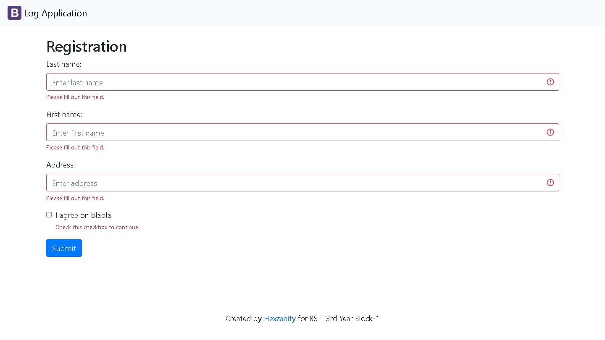
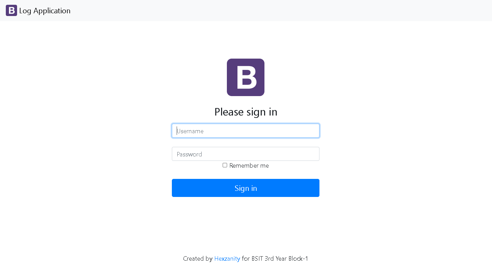

# logApp-scaling-octo
# Name of App
    LogApp
# Description
    1. Registration(View) [index.php] This LogApp is used to records information of a certain people. That can be used for attendance to view what date he entered
    in what event you will use it.

    2. Log In(View) [guestbook-login.php] In this view, you need to use your username and password stored in the mySQL data table which i use is "Account" with a Column of ID, User and Password. Inside the User = "hector" and Password = "herrera". 

    3. List View(View) [guestbook-list] You will see the records of People with a Timestamp, when they enter an event. 

# Installation:

**Requirements:**

- Php language
- MySQL or PhpMyAdmin Through WAMP64
#
    Steps by Steps(How I Created the LogoApp):
    1. I created my own database using WAMP64 and MySQL.
    2. To store the information in index.php and connect the data inside the MySQL, I fix the connection "config/config.php" and "config/db.php" 
    that is needed to run in every PHP page. I also replace at the bottom of the code my Github account.
    3. I use " (isset($_POST['submit'])) " to set every input such as "lastname, firstname, address and the date and time stamp" in index.php,
    and use query to use database code that will distribute every input in the database that will be place.
    4. To log in and view the list, in guestbook-login.php I connect the table of Account in MySQL to the page and if there's no such existing data from each row
    which are user and password then it will prompt a message that it is not valid to go another page.
    5. In guestbook-list, i also connect the "config/config.php" and "config/db.php" for easy and fast way to show the database of "Hexzy" where will find the
    table "person", such that there's already a code foreach in PHP below, i replace the persons as "$result as $person" so, the date will be distributed 
    to every row that will be shown.
    6. In the last part, i used " header('Location: guestbook-login.php') " to the page "guestbook-logout.php" to go back in the log-in page.

**Procedure:**

    1. Open your installed WAMP64.
    2. Import the Database inside the folder LogoApp->HERRERA->MySQL DATABASE to your MySQL or Phpmyadmin.
    3. Browse from your C: Drive:>Wamp64>www>(NameOfFolderYouWant).
    3. Go to your favorite browser then type "localhost/Name Of Folder Said in Step 3.
    4. Click on LogApp Folder.
    4. It will now preview the Registration(View).
    5. You can login through: localhost/(Name)/LogoApp/guetbook-login.php
    6. Now you can view your Registered Infos after you login.

**Author:**
# Hector A. Herrera Jr. (Github: https://github.com/hexzanity)

    
